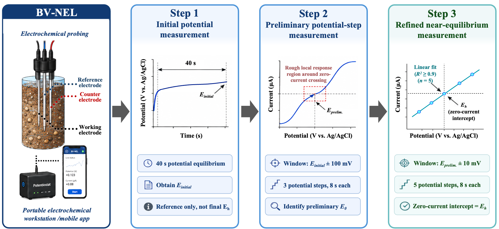
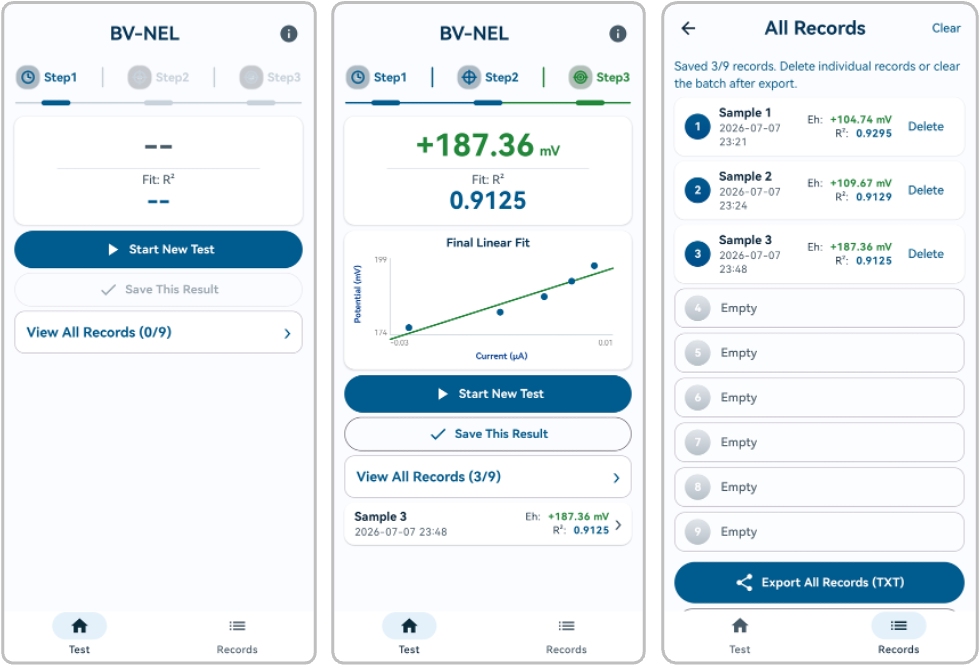

# BV-NEL

**BV-NEL** stands for the **Butler-Volmer guided near-equilibrium linearization method**. It is a rapid electrochemical method for measuring the redox potential (Eh) of sediments or soils. The method uses a portable electrochemical workstation and a three-electrode probe to actively sample the near-equilibrium current-potential response, then estimates Eh from the zero-current intercept of the final local linear fit.

This repository provides the Android App developed to implement and control the BV-NEL measurement workflow. The following files and documentation focus on the App source code, user interface, data acquisition procedure, result calculation, result storage, and data export functions.

## What BV-NEL does

BV-NEL standardizes the measurement process by combining:

- controlled potential-step measurement;
- current acquisition from the electrochemical workstation;
- automatic extraction of steady-state current values;
- coarse and refined linear fitting;
- quality control using the fitting coefficient (R²);
- saving, deleting, clearing, and exporting measurement records.

The software is implemented as an Android Studio project and is used to control the portable electrochemical workstation through USB serial communication. The customized portable electrochemical workstation used in this implementation was provided by **Wuxi Signal Technology Co., Ltd.**

## BV-NEL measurement workflow

  

 

BV-NEL follows a three-step workflow:

### Step 1. Initial potential measurement

The initial open-circuit potential is recorded for **40 s**. The mean potential within the final **1 s** is used as the initial potential, **E<i>initial</i>**.

### Step 2. Preliminary potential-step measurement

A coarse local response is measured around **E<i>initial</i> ± 100 mV** using **3 potential steps**. Each i-t measurement lasts **8 s**, with data recorded every **0.1 s**. The average current from the final **1 s** of each i-t step is used for linear fitting to identify a preliminary zero-current potential, **E<i>prelim</i>**.

### Step 3. Refined near-equilibrium measurement

A refined near-equilibrium response is measured around **E<i>prelim</i> ± 10 mV** using **5 potential steps**. Each i-t measurement lasts **8 s**, with data recorded every **0.1 s**. The average current from the final **1 s** of each i-t step is used for the final current-potential linear fitting. The final Eh is calculated from the zero-current intercept of this local linear fit. The fit is accepted when the R² value meets the preset quality-control criterion.

## How to use

1. Open this repository in **Android Studio**.
2. Sync the Gradle project and build the `app` module.
3. Install the software on an Android device that supports USB communication.
4. Connect the portable electrochemical workstation to the Android device using a USB data cable.

## Example files

Schematic diagram of the App page:

  

Usage process:

1. Connect the three electrodes to the electrochemical workstation.
2. Connect the electrochemical workstation to the mobile phone using a USB data cable.
3. Click **Start New Test** to begin the measurement.
4. Click **Save This Result** to customize the sample name.
5. After the test, click **Records** to display all results, and then click **Export All Records** to export the measurement records.
6. After the tests of 9 samples are completed, click **Clear** to clear the current records, and then continue to measure the subsequent samples.

## License and use restrictions

This repository is released for non-commercial academic research, teaching, peer review, and reproducibility purposes. Commercial use is not permitted without prior written permission from the copyright holder(s) or the corresponding author of the associated publication. No patent license is granted. See `LICENSE` for details.

## Repository notes

Signing keys, APK/AAB build outputs, local configuration files, and private hardware credentials should not be uploaded to this repository.
